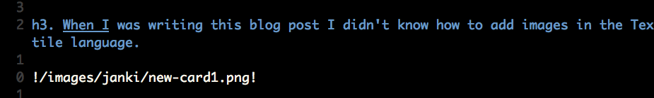

**EDIT: Update To JANKI Method** For many years after I wrote this post I have continued to use flashcards to learn and have made a number of refinements to my recommendations. I summarised these points in [Janki Method Refined](http://www.jackkinsella.ie/articles/janki-method-refined), part 2 of a separate article, [Guide to Autodidactism](https://drive.google.com/file/d/1JCHkqVoX598Ob_111khrGoJ5cpeh_ahU/view?usp=sharing), and, in 2020, within a series of YouTube videos: {: .janki-rule}

<iframe width="560" height="315" src="https://www.youtube.com/embed/kshXDo8psj8" frameborder="0" allow="accelerometer; autoplay; clipboard-write; encrypted-media; gyroscope; picture-in-picture" allowfullscreen=""></iframe>

**This video contains my most up-to-date opinions on using SRS to improve programming. Start here.**

This is a guide to becoming a productive programmer quickly. In his book _Outliers_, Malcolm Gladwell told the world it takes 10,000 hours to master something. Practice three hours a day, and you will shine in ten short years. Millions of readers felt inspired since they too could become the next Bill Gates, if only they put in the hours. As the days turned to months we discovered that 10,000 hours was a lot longer than we anticipated. Limitless potential transformed into fantasy about what might have been.

**Janki Method** is an attempt to shorten the time needed to learn programming. It grew out of my impatient dream to build an automated web business that would free me financially, geographically and temporally. I didn't want to wait 10,000 hours. I suspect you don't either.

Well-intentioned learners don't always learn quickly, despite their smarts and enthusiasm. For most, eventual ability is determined by the volume of time expended. Malcolm's 10k sounds about right.

You’ve read that learning by doing is better than passive reading; that expressing ideas in writing forces understanding; that knowledge needs constant revision to stay fresh; that creativity comes from linking disparate ideas; and that your past mistakes are your best teachers. How many of these ideas do you apply to your learning efforts?

**Janki Method** is built on the suspicion that Malcolm’s 10k to mastery can be hastened if you take a focused approach to learning. The core of Janki Method is the use of a spaced repetition flashcard system, [Anki](http://ankisrs.net/), programmed by the brilliant Damien Elmes.

By following my approach, I believe that any intelligent and disciplined reader can achieve proficiency\* in a given field of programming (e.g. web applications, iPhone applications) in less than 12 months.

I call this the **Janki Challenge**, and I invite you to take part.

## Problems With Learning

## Problem 1: We Forget Too Quickly

Have you ever spent a week studying for an exam, only to forget 90% of what you learned within 2 months and everything else within a year?

Forgetting impedes learning knowledge-intensive skills such as programming. You need to remember various languages, solutions, libraries and gotchas if you want to build large applications. Because technical material can be so abstract and dry, you forget particularly quickly.

\_The first rule of \*\_Janki\*\* boosts your memory:\* **“Every time you learn something new create a question and answer flashcard and add this card to Anki.”** {: .janki-rule}

Anki is a Spaced Repetition System. Most algorithms make computers efficient; Anki makes you efficient. Using the minimal number of repetitions necessary for permanent retention, Anki drills flashcards into your long-term memory.

Begin by creating a deck of flashcards called, say, computer science. A deck contains many cards, and each card consists of a question and an answer. You tag these cards with the categories that best describe their contents. For example, one card might be tagged with 'Rails', and another with ‘SQL'. Each card can have numerous tags, something useful given how technologies frequently overlap.

Over time you will build up a repository of knowledge on programming, cleanly categorized, easily searchable and regularly backed up in the cloud. Keeping a repository like this is useful, but it doesn’t do anything to help you keep the knowledge inside your head. The key to this is doing your Ankis.

Every morning Anki calculates which cards you risk forgetting, and then prompts you to review these cards. Doing your Ankis only takes a few minutes per day, since you only need to review a fraction of your deck on any given day.

For every card you review, Anki shows you the question side with the answer side initially blocked out. Your job is to answer the question in your head, and then reveal the answer and check whether you got it right. After you answer, four buttons appear at the bottom of the screen: “again”, “good”, “easy” and “very easy”. Assess how easily you could recall that card and then press the appropriate button. Based on which button you press, Anki determines when next to show you that card, so answering honestly is crucial if you want the algorithm to work.

Do this every day and you will not forget.

## Problem 2: We Give Up Too Soon

Most people fail to learn programming for the same reason they don’t get good at playing guitar: they give up too soon. Although they practice hard for the first few weeks, they soon lose motivation, and give up before they get results.

Trying to learn using a rhythm of intense activity over short periods of time followed by long pauses is problematic. Your mind needs time to absorb what it learns, so learning skills cannot be condensed into a weekend. By accepting this reality and using a learning approach that emphasizes incremental daily effort, you will be less likely to burn out and more likely to succeed.

\_The second rule of \*\_Janki\*\* encourages a commitment to daily learning:\* **“You must use Anki every single day - including weekends and holidays - and commit to doing so indefinitely.”** {: .janki-rule}

Doing your Ankis must hold the same force of habit as brushing your teeth, and you should feel naughty if you ever miss your Ankis.

Rule 2 isn’t as demanding as it might at first seem. After a few months of practice you will be able do your Ankis in 5-8 minutes. Finding that time shouldn’t be a problem either, since Anki is available on smart-phone, meaning you can review while you walk to work, sit in the bus or have a spare minute at the office. Anki even synchronizes the state of your decks across all your devices, so changes to your desktop deck will be reflected across all of your devices.

## Problem 3: We Learn Out Of Context

Learning out of context is wasteful. Reading a textbook from cover to cover may be interesting, but if those concepts are not relevant to the technical problems you currently face, then you will lack the mental context needed to assimilate that knowledge effectively. Incomplete understanding and wasted effort ensues.

\_The third rule of \*\_Janki\*\* keeps you focused on what is important in the moment:\* **“Learn in context. Pick a project, and learn only what you need to get it done.”** {: .janki-rule}

#### When I was writing this blog post I didn't know how to add images in the Textile language.

##### Step 1: I Googled it.

##### Step 2: I tried the code out by adding an image to the post.

##### Step 3: After checking that it worked, I added my new technique to my Anki Deck.

## Problem 4: We Think We Can Learn Without Doing

> _“I learned about sex the hard way – from a book.” **Eddie Izzard**_

Like sex, programming is better and more enjoyably mastered through practice. Learning without practice insulates you from reality.

When you read about programming without trying out the code, you form an internal representation that is incomplete, poorly understood, and difficult to apply practically.

You will fail to notice critical details. Many things may seem trivial when you first read about them in a textbook. Maybe it's the placing of quotations around a parameter to a function, or rules about where whitespace is allowed. These overlooked points can often be critical in practice, and anything less than complete understanding will cripple your productivity. It is only by trying code out that you will notice the nuances of these rules, and really understanding the language, techniques, and commands in question.

\_The fourth rule of \*\_Janki\*\* grounds knowledge in reality:\* **“Only add a card to your deck after having tried to use the item of knowledge therein.”** {: .janki-rule}

Say you are working on an application powered by an SQL database. To build it you will need to refer to literature on database design and SQL (a query language for selecting records from database tables). As you work on the application you will be exposed to new concepts. Try out each new nugget of knowledge before adding it to your Anki deck. If, for example, you read about how to delete a row in a database table, then you should try deleting an actual row in your database before creating the Anki card detailing that SQL query.

## Problem 5: We Make More Mistakes Than We Need To

Our past mistakes serve as excellent memory aids. This is a major reason why we learn by doing. That said, not all past mistakes are equally effective at teaching us lessons; there is a correlation between the emotional impact of an error and the length of time that lesson will remain in memory.

Say you make a big mistake. You accidentally push incomplete code to a live server, taking your app down for 12 hours. You panic to fix it, and as the customer complaints flood in, you feel stupid and embarrassed. This emotional punishment serves as a strong reminder of your error, and you will be more careful when pushing code to a server in future.

Errors with emotional impact are, thankfully, rare, and you are unlikely to need **Janki Method** to learn from these. But what about the rest of the mistakes we make, where the emotional element is diminished or even absent? We may need to make these mistakes many times before eventually learning our lesson.

Mistake repetition is the number of times you need to commit a particular mistake over a lifetime before learning a permanent lesson. Because mistakes are costly, embarrassing and potentially career threatening, it is sensible to minimize their occurrence. Bosses, customers and co-workers understand a first time mistake, and all but the most unreasonable will forgive you. They will not, however, feel so forgiving the second or third time you get the same thing wrong.

\_The fifth rule of \*\_Janki\*\* method minimizes mistake repetition.\* **“Every time you make a mistake carry out a post-mortem and try to figure out the lessons in the experience. Think about what you would need to know to prevent that mistake from occurring again, and turn this insight into new flashcards.”** {: .janki-rule}

By applying this rule you will substitute real world mistakes with Janki reviews, and you will consequently learn from your mistakes more quickly and with less embarrassment and real world error.

Ankifying your past failures doesn’t just prevent their repetition. It also helps you understand your domain, since the act of performing a post-mortem analysis and examining the underlying causes of your error encourages deep thought. Instead of just creating the cards you need to prevent that particular error, you might immunize yourself against that entire class of error.

Every mistake becomes a learning experience. Messing up still sucks, but you feel a small sense of victory knowing that you’ve just found a way to improve, and you will feel assured by the certainty that you will never make that mistake again.

## Problem 6: We Do Not Reflect On The Big Picture

By following the initial five rules of **Janki Method** you will quickly become proficient with the low level details of programming: the name and use cases of functions and commands, their expected inputs and expected outputs, solutions to common bugs, and techniques for keeping your code organised.

As your experience grows you will be faced with bigger questions, such as structural decisions about your application, techniques to minimize complexity, workflows for managing simultaneous versions of your code, and the tradeoff between code performance and elegance. Answering these questions requires deep knowledge and sizable experience, and for this reason you must never miss an opportunity to grow your knowledge in these overarching issues.

\_The sixth rule of \*\_Janki\*\* method encourages regular critical reflection:\* **“At the end of every project ask yourself what lessons you learned and what you would do differently if you were to repeat the project with the benefit of hindsight.”** {: .janki-rule}

After a large project, such as completion of a new app, take some time to reflect. Ask yourself big questions, such as:

- Did I waste time going down any dead ends? Is there anything I could do in future to help me foresee these, and prevent them from happening again?
- Did I choose the right technologies? Can I come up with a schema to help me make the right choices next time?
- Did I accurately estimate the time required?
- Could I have built simpler architecture? Could I have figured this out earlier?
- Can I create a checklist to ease development of that kind of feature in future?

Some of these questions will be difficult to answer because you have to run through alternatives in your head, thinking about the benefits and tradeoffs of each. This effort is worthwhile since sensible architectural decisions prevent wasted effort. Without active reflection you will be less likely to notice these project level patterns, and so your wisdom will grow more slowly than it otherwise would.

## Problem 7: We Let Our Knowledge Representations Grow Messy

Like a front lawn left idle, your Anki decks can grow ugly. Perhaps one of the programming languages you previously learned has changed dramatically in version 2.0 and now a percentage of your cards are invalid. Perhaps some of your cards are no longer worthy of keeping in periodic review – their usefulness doesn’t justify the cumulative revision time needed.

As you learn, you will discover simpler ways to understand concepts; without updating your cards to reflect these improved paradigms you risk losing these insights forever. Often a group of cards can be replaced with a single card on a higher order concept.

Sometimes you will see links between cards in your deck. If you note the connection between these cards you create multiple neural paths to the same item of knowledge. If one path were to fail, you could still arrive at and trigger that knowledge from another route. The ability of mind maps to help you remember works using a similar idea. By looking for and noting these connections in your decks you add a layer of redundancy to your knowledge representation that further insures against future forgetting,

\_The seventh rule of \*\_Janki\*\* keeps your decks in shape.\* **“Delete or modify any incorrect, outdated, difficult to remember, incomplete or unnecessary cards. Update existing cards as improved understanding dawns.”** {: .janki-rule}

### The following shows a poor understanding of Git, later updated with a more nuanced understanding.

 

## Problem 8: We Do Not Reference Primary Sources

Graphic designers, artists, architects and other creatives keep scrapbooks of designs they like. Later, when working on a project, they draw inspiration from these same scrapbooks.

As a programmer, your primary source of inspiration will be other people’s code. Download open source projects (e.g. on [Github](http://www.github.com/)) and read through the code. Look up parts you don’t understand, and create new cards as necessary. Get a pen and paper, and sketch out the paths through the program. What are the inputs, and what are the expected outputs? What happens to the data as it moves through the program? Why was it designed in this way? What techniques were used?

By reading code you will be exposed to various styles of programming and solutions to programming problems. You will see things you like, and lots of things you don’t like. With time you will find your own style.

\_The eighth rule of \*\_Janki\*\* encourages you to use your readings of other people’s code as a source of learning:\* **“Read code regularly. If you come across something interesting – be that an algorithm, a hack, or an architectural decision - create a card detailing the technique and showing the code.”** {: .janki-rule}

## Janki Method: More Than Just A Memory Aid

My initial goal with using Anki to learn was to stop myself from forgetting, and Anki delivered on this promise. What I wasn't expecting was the secondary advantages that emerged through long term daily use.

## Advantage 1: Program Faster

Knowing thousands of commands saves time otherwise spent looking up reference materials. You instantly recall previous solutions when faced with a problem, and dozen of possibilities spring to mind when architecting a system. You will read other people's code rapidly, confident in your understanding. The closest analogy is fluency in a natural language. You will speak code.

Most of the time I spend programming is spent debugging, that is fixing errors in your code or in the code of other programmers. This is where a deep knowledge of the platform will speed you up the most. Debugging consists chiefly of gathering information. What was the system supposed to do? What data was in the system when we saw the error? What could have gone wrong? Frequently a single delinquent line of code can be the cause of a bug that takes down an entire site. The hard part is figuring out which of the thousands of lines of logic caused the issue.

Let’s take an example. Say your program uses 100 functions and 70 of these are built into the language. That means that there were 30 custom defined functions. If you know with confidence the inputs and outputs of the 70 built-in functions, then debugging is simplified, since you will only need to figure out how the remaining 30 custom functions work. Considering that custom functions are themselves defined in terms of built-ins, this task should not take too long either. Total certainty about the syntax, inputs, outputs, and uses of the built-in functions lets you quickly isolate unknowns and bring the bug to surface.

Brainstorming ability is improved through **Janki Method.** Deep knowledge in mind means you can try out alternatives on paper rapidly and so increase your chances of coming across a cheeky non-obvious solution to your problem.

You might argue that you will get the same speed boost with knowledge earned through experience. That is true, but this argument misses the point. Janki enables you to gain that same knowledge faster, and retain it for longer. If you’ve ever forgotten how to do something after leaving it aside for a few months, then Anki is for you.

## Advantage 2: Chunking

Skill in a technical field is the product of your intelligence and your knowledge. Weakness in one can be overshadowed by strength in another. Bright yet inexperienced can perform on par with dull yet experienced.

This point is best illustrated by example. Let’s multiply 130 by 30 using two approaches.

**Approach 1**: You know that multiplication is repeated addition, and so the problem becomes 130 + 130 + 130... and so on. Applying the rules of addition you arrive at 3900 - eventually. Let’s call intelligence your ability to carry out these individual calculations quickly.

**Approach 2**: Perhaps you remember from your multiplication tables in school that 13 X 3 is 39. You might also remember that the commutative and associative properties of multiplication let you simplify 130 X 30 to 10 X 13 X 3 X 10 and finally to 39 X 100, which can be calculated trivially as 3900. Your intelligence, or speed of addition here, is irrelevant since domain knowledge let you simplify the problem dramatically.

In approach 1, the problem was labour intensive because you did not use knowledge to ease your calculation. This wasn’t the case in approach 2, where you reasoned using higher order chunks of knowledge, so solving an otherwise lengthy problem with ease. The application of remembered chunks of knowledge to problems at hand is called **chunking**.

> If you remember the answer to a question, you have no need to deduce it in the moment, and so your mind is free to deduce more abstract concepts. This is the value of chunking.

**Janki Method** encourages chunking. This was an unexpected benefit, yet ultimately the most useful to me. After six months of daily application you will reason about programming concepts using mental shortcuts equivalent to those used to simplify the multiplication problem in approach 2. Maximize chunking by adding increasingly abstract rules and concepts to your decks, and making an effort to draw on these ideas when solving problems.

## Advantage 3: Searchable Archive of All Your Programming Knowledge

Has your computer ever spat out an error message and, although you remember seeing it before, you don't remember how to fix it? Before I started **Janki Method** this would happen to me a lot.

The first time I saw the issue I would spend half a day solving the problem. Six months later the problem would happen again, perhaps in a slightly different form. Even though I was vaguely aware of having seen it before, I'd forgotten how to fix it.

This felt wasteful and I didn't like it. I don't like having to solve the same problem twice. **Janki Method** helps prevent this from happening.

Anki has a search feature that finds all matching cards in your deck. You can even filter by date or tag. For example you might search through cards containing the word "ssh" created more than 6 months ago and tagged with ‘deployment’.

After solving a bug you should always add some cards to your deck containing the knowledge needed to prevent that bug from occurring again. Better yet, abstract one level and add cards containing the knowledge needed to prevent that class of bugs. Now, whenever you are faced with a bug the second time, all you need to do is search your archives.

## Advantage 4: Not Reinventing The Wheel

Modern programming languages have many algorithms built in, or easily included as parts of a readily available core library. This is especially true of high-level languages such as Ruby, and Python. You want to sort an array? Array#sort does the trick.

If you didn’t know the sort algorithm was built into the language, then you might write your own in its place. When you do so you risk making mistakes and missing out on low level optimizations. Furthermore you alienating future users of your code, who might think there was a reason other than ignorance for why you wrote a custom sort algorithm instead of using the one built into the language.

By filling your deck with built-ins from your chosen languages you will be less likely to accidentally implement existing features in a confusing, half-assed, and bug-prone way.

## Appendix

## Should I Download Other People's Decks?

Anki has an online searchable database of other people's shared decks. Although there are not many decks for computer science, you might be able to find some and piece these together as the basis for your deck.

Be careful with this. You might add facts to your deck that are of no use to you, and you may end up reviewing facts that you do not fully understand, thus building a poor foundation for future knowledge.

Ideally you should build your own decks from scratch, drawing from your programming experiences; your readings of other people’s code, textbooks; viewing educational screen casts; and reviewing past mistakes and previous projects. By creating your decks in this way, you keep them filled with well-understood real world contextual knowledge, phrased and categorized in a way that makes sense to you.

If you are going to use other people's decks, make sure you understand every card you learn. Be sure to try the code out when you first see it; this takes more discipline that you might have. Make sure you trust the author of the deck - you don't want to learn incorrect or dated knowledge, and sadly most of the decks freely available are abysmal.

A good alternative, that I would recommend, is Gary Berndhart's [Execute Program](https://www.executeprogram.com/) — he has painstakingly ordered an SRS syllabus for an excellent learning progression.

## What Knowledge Belongs in my Decks and What Doesn’t?

When I first began **Janki Method** I was over-zealous in my addition of facts to my decks. In particular, I added stacks of cards for third party code libraries. This turned out to be wasteful, seeing as I rarely used this knowledge. Technology moves rapidly, and today’s in-vogue libraries become tomorrow’s baggage from the past. I ended up deleting many of these cards after having wastefully committed them to long-term memory.

It's not always easy to distinguish between knowledge worth keeping long term and knowledge only needed short term To help me with the decision I came up with this schema:

Only enter a card into your decks if one of the following conditions is met:

- a) The fact contains general wisdom about computer science (refactoring, regular expressions, object orientated programming, memory issues and so on).
- b) The fact relates to a major technology that has been around for a long time and is probably here to stay (Linux, Ruby, Javascript, VIM, git, HTML, CSS, SQL)
- c) The fact, while part of a library that is likely to change, is something I use everyday and something I foresee using for some time. Bonus points if the technology is in high demand, since this equates to higher consulting rates. (Rails, jQuery).

## What are the main keyboard shortcuts I need to know?

You will be reviewing your cards everyday so small time-savings here quickly compound. Keyboard shortcuts are crucial.

Press **Enter** to reveal answers and then evaluate your response with the keys **0**,**1**,**2** or **3**.

**Command + Backspace** deletes a card. Use this for troublesome/incorrect/out of date cards.

**Command + E** lets you edit a card and then **Tab** moves the cursor between the question and answer panes.

## The Janki challenge

Want to learn to program and start building powerful apps? Then take the Janki challenge. Download Anki (link below), pick a programming project, and publicly announce to your friends that you’ve committed to learn to program.

_Why public commitment? Public commitment creates social pressure that pushes you to honour your promises to the world. This pressure will see you through the difficult first stages where you will be most tempted to give up._

I believe that if you follow the system exactly as described above, you will learn to program significantly more quickly than you would using any other approach other than one-to-one tutoring.

## Further Reading

- [5500 web development flashcards, made by me](http://www.oxbridgenotes.com/other/web_development_flashcards)
- [Anki - Available for Free Download](http://ankisrs.net/)
- [20 Rules for Formulating Knowledge in Learning](http://www.supermemo.com/articles/20rules.htm)
- [Want to Remember Everything You'll Ever Learn? Surrender to This Algorithm](http://www.wired.com/medtech/health/magazine/16-05/ff_wozniak?currentPage=all)
- [Genius and Creativity](http://www.supermemo.com/articles/genius.htm)

## Source

[Janki Method — Using SRS to Improve Programming](https://www.semicolonandsons.com/articles/janki-method)
