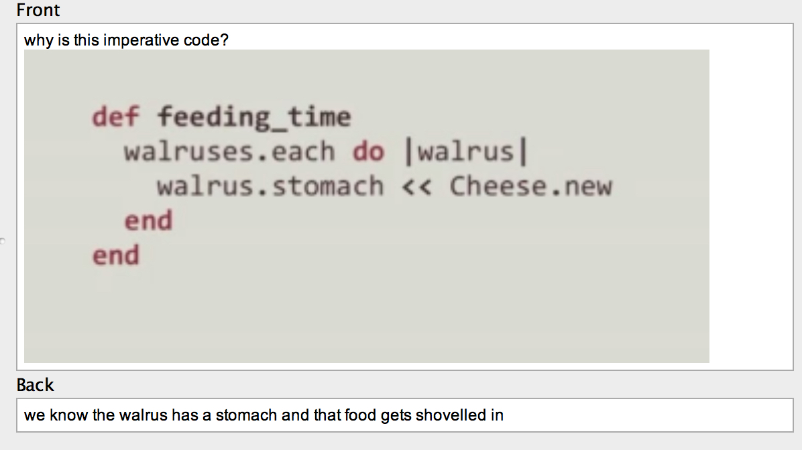
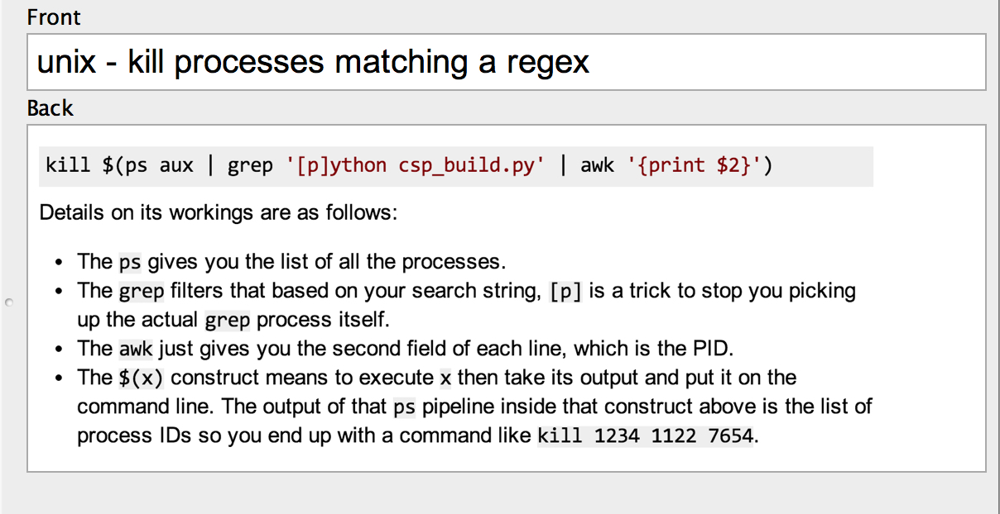
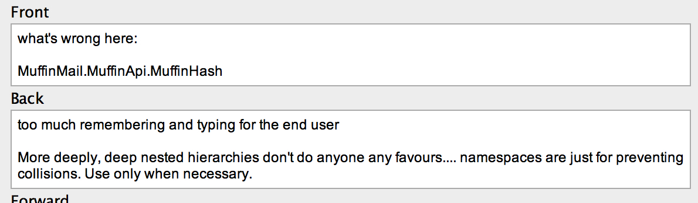
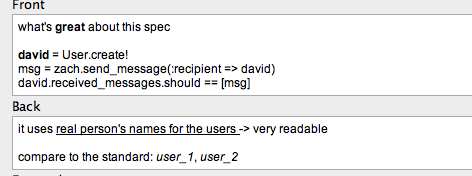
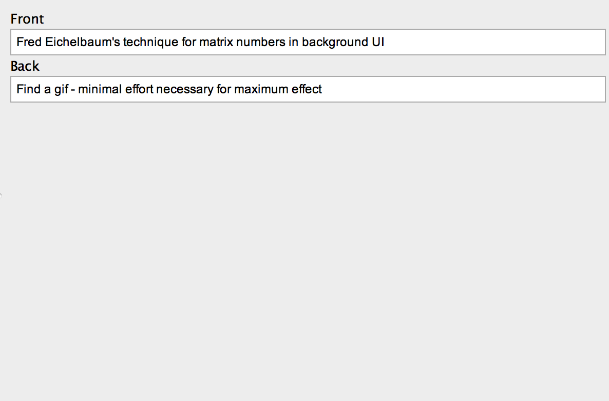
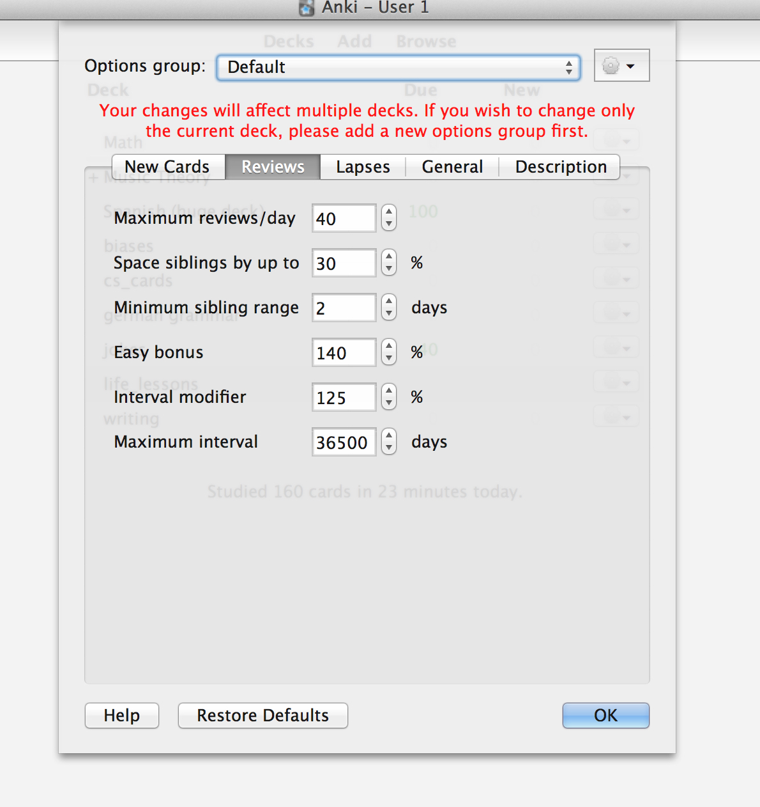
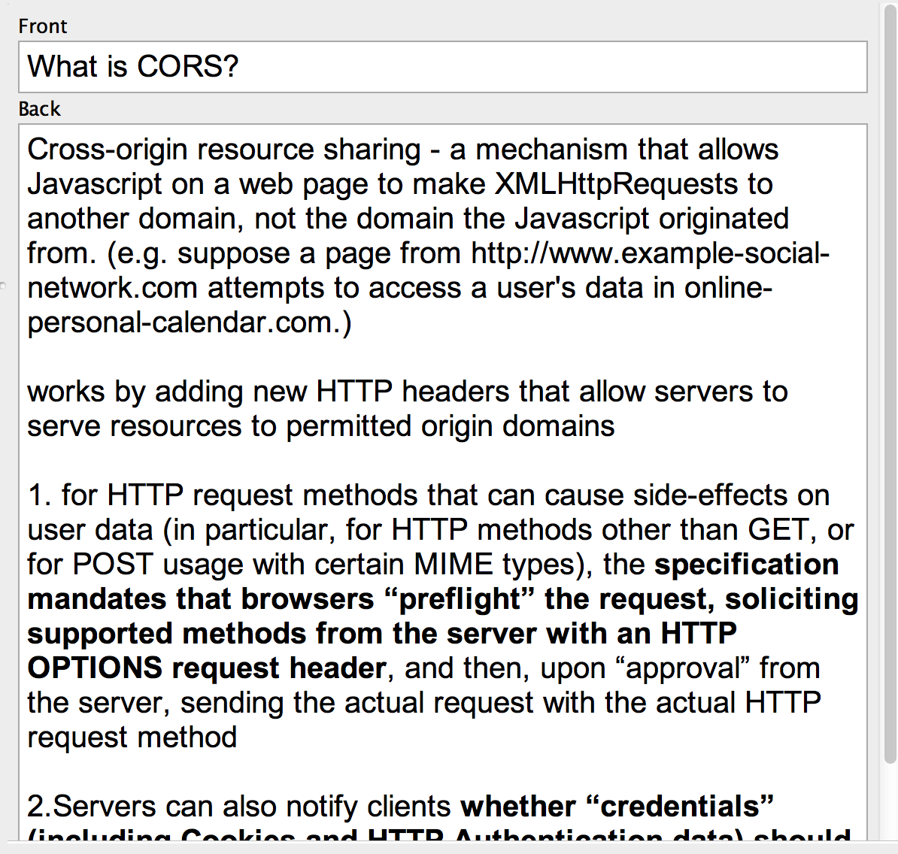
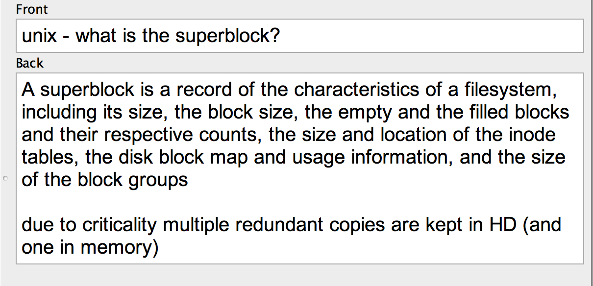
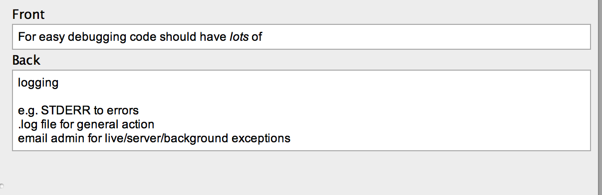
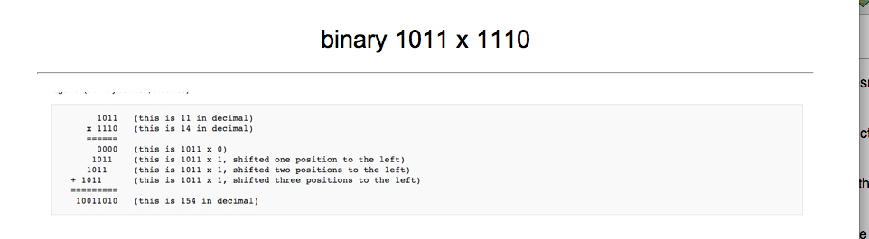

Over the last few years I've made a [public fuss](http://www.jackkinsella.ie/2011/12/05/janki-method.html) about [using spaced-repetition flashcards to speed up learning programming.](http://www.oxbridgenotes.com/other/web_development_flashcards) I'm aware that the novelty of an idea can overshadow rational evaluation of its usefulness so the aim of this post is to follow up my early enthusiasm and refine my methodology following a further year's experience in unfailing daily card reviews.

I've condensed this into point form to save us both time. Each subsection represents a principle I've adopted in my learning strategy, the overarching goal of which is to study as much material as possible in the shortest amount of time.

## 1\. Screenshot Cards > Plain Text Cards.

In my original method I pasted plain text snippets of code into my decks. I now take screen-shots (using a keyboard shortcut) of the code examples from programs I open in my text-editor, from programming books and from websites such as Stack Overflow. I save time, not needing to type out the code again into Anki. I also get syntax highlighting for free, which allows me to read the cards more quickly and speeds up my reviews.

Permit me to add some Tim Ferris style non-rigorous scientific intuition: I believe that photos of the origin of your flash-carded fact aids memory on the basis that i) location based memory is stronger than others; and ii) the colours, the font and the website URL create a richer, more unique memory than yet another card of text and thus slot into memory that bit more easily.

## 2\. Focus On Available Functionality Over Detailed Info

Initially I placed detailed information about every function into my decks‚ containing class name, return values and their types, argument lists, their orders. Through the years I've found that this information becomes hard to remember once you add other programming languages into the mix, particularly ones with similar function names (e.g. each()) but slightly different usage. Moving from language to language made me realize that such detailed information offers short term advantage of speed but stales quickly. Nevertheless I'm happy I have one "mother-tongue" language (Ruby for me) at this level of familiarity because it means I can sketch out personal utility software, scripts and hacks rapidly.

More important to commit to memory is awareness of _what_ built-in functions exist within a language and what services exist within an operating system or protocol. I create cards for various linux commands or useful Javascript built-in window properties.

Sometimes I create what I call "hybrid cards" that combine a summary of what a command _is_ with the details of its operation. To do this I follow the basic "what it is" answer with either an in-depth description or a screenshot of the code in use (with real world arguments and outputs), similar to how language learners furnish new vocabulary with example sentences. As I review the cards I optionally glance at the example of the function in use, but I do not attempt to learn this off by heart. If, at a later date, I happen to need that specific feature for a project I can isolate those cards (using Anki's drill functionality) and learn the more detailed info.

## 3\. Scrapbook Cards

Graphic designers keep scrapbooks of artwork and designs they admire then refer to their scrapbooks when seeking inspiration in future projects. Programmers can do this too. Whenever you see an especially elegant, efficient or clever morsel of code in a library, blog post or scribble down a note or snap it up in a screenshot then place it in your deck.

To transform a photo of a code example into an Anki friendly question/answer pair I create a card with a question before the screenshot, something along the lines of: "What's great about this code?". Within the answer I identify in bullet-points the strengths of the technique, forcing myself to identify and verbalise my learnings, rather than leaving it as vague wordless appreciation.

Sometimes I invert this process and analyse awful code, making "What's wrong with this?" cards, again constructing rules or prescriptions against what is bad. The eventual goal of both these processes is rapid perception of quality in my own programming.

## 4\. Ordered Info Doesn't Ankify Well

Initially I thought any and all technical knowledge ankifies well. Since then I've reduced my enthusiasm and noticed one major exception: information where order/structure is essential. For example I made extensive cards on setting up SSH keys on a server, a complex, many-step dance between your laptop and your remote server. Despite my Anki-fed reviews, I never remembered the full ordered process in practice and always resorted to an online guide. My time ankifying and reviewing the SSH rules was wasted.

I'm not sure of the exact cause of my failure. Perhaps I created flashcards incorrectly for this type of info and I could have rectified with additional SSH flashcards that explicitly question what action becomes before or after another. But my intuition is that creating so many additional cards is a poor time-sink and I'd rather keep and resort to an updated checklist or diagram of the ordered process.

## 5\. Suspend Technology On Hold. Drill When Needed.

I decided that fringe technologies (languages, libraries, feature sets and concepts rarely used in my work) were not a good use of my limited review time and after I ankify this material in the context of a project using them (e.g. using Backbone for a web app last year), I suspend the reviews of those cards. If another project using that tech comes along I use Anki's **drill functionality** to rapidly revise the technology prior to embarking. If such a project never materializes I leave the cards indefinitely suspended, perhaps never to be used again.

You might point out that making Anki cards for fringe tech is wasteful in the first place— maybe it is for you but i) I find it difficult to identify what will be fringe tech vs. core tech on first encounter and, moreover, ii) I find the discipline of actively turning technical material into questions and answers focuses my reading and helps me interrogate the text for actionable information more quickly.

## 6\. Lower The Intensity

Standard SRS usage theory (as espoused by P. Wozniak) requires we review all the cards in our deck that become due on any particular day in order to commit knowledge to long-term memory with the greatest possible efficiency. I tried this for perhaps two years but I eventually found the review burden too intense. To combat this I limited the maximum number of reviews in my programming deck to 40 cards per day and modified the deck settings within Anki to increase the easy bonus (extra time between cards you mark as easy) and the interval modifier (time between reviews of _any_ card). The effect of the ease-spacing option is to show easy cards less frequently (they do not pose a continuing challenge to me, often being foundational in more advanced concepts within my deck, so the trade-off is reasonable), whereas the interval modifier tweaks the algorithm to space all cards further apart regardless of difficulty, meaning more days between each review and thus less reviews due on any particular morning.

The price I pay for this lowered revision time is that I may not reviewing along the "forgetting-curve", meaning a globally inefficient learning strategy. I'm OK with this because I recognise that programming languages come and go and I realize that I may not be programming in 10 years time—my primary goal is to be as damned fast at programming today as I can train myself to be. Besides, reducing the efficiency is a reasonable price to pay if it ensures you stick with the revision routine, performing a similar function to cheat days in difficult weight loss diets.

## 7\. Numbered Reading

Whenever I read a printed programming textbook I place a number (1,2,3...) in the margin beside any point I wish to later commit to Anki, alongside a short reminder, e.g. "file system efficiency". Once I finish the book I scan through it again, adding a card to Anki for each numbered point I continue to perceive as worth remembering.

The reason I do this is i) not to break up the flow of reading by leaning over into my laptop and ankifying each point I encounter, thus saving time by batching and ii) to account for how textbook authors sometimes elaborate a point more clearly in later chapters and only use the best explanation in my flashcard decks.

## 8\. Emphasise Language Invariant Memes

As I've learned programming languages and libraries I realized that part of the value of applying Janki method in my first programming language, Ruby, was learning the "memes" that recur in other languages. For example, "functional" methods in Ruby's Enumerable module, such as each(), map(), select(), reject(), and zip() recur under the same or similar names in Javascript, Lisp, Python and various libraries (such as Javascript's Underscore library). Knowing the meaning of these functions‚ and how to use them‚ cuts down on the time taken in learning a new environment. Similarly, learning the details of how linux interacts with files illuminated File/IO interaction methods in Ruby, C, and Python.

I don't have a fool-proof way to differentiate language invariant memes from "this-language-only" ideas, save for a few rough rules of thumb. Examples of elegant code or ugly code (such as magic numbers) frequently have parallels in other environments (or, if not paralleled yet, the practice can be productively cross-pollinated); functions that interact with the underlying Operating System (threading, IO), so long as they remain un-abstracted, reuse the same concepts as other languages running on similar systems (linux, Android, iOS, Windows); many languages share the same regex ideas (although annoyingly a variety of syntaxes exist); concepts like binary math, string encoding, performance optimisation, debugging, and object-oriented programming hold strong across language barriers.

## 9\. Execute Code For Yourself After Repeat Failures

When I become aware that I have failed a card a number of times I test that code in a console or do its equivalent (e.g. for Vim commands I tap the keyboard shortcut into Vim). I do this at least twice in a row. This helps my fingers learn the command, proves to me that the code works, and gives me contextual understanding, the effect of all these being that I am more likely to remember it next time.

## 10\. Brainstorm Uses For The Card. Or Delete It.

As I review cards of programming features I've never used I ask myself: Does this feature have poor real-world applicability or does the culpability lie with me in not putting in enough effort to figure out use cases? By way of answering I brainstorm ways of using the feature in my current projects, even if it's in a ridiculous manner. This practice disciplines me to applying my knowledge— and, in the cases where I cannot think of any good uses, I admit defeat and prune my deck by deleting the card.

## 11\. Bold The Key Point

You'll always want to take measures to reduce the time you spend reviewing your decks. A simple, effective solution is to bold the key word or point in the question or the answer or in both. This technique is especially helpful when you have a number of flashcards that deal with similarish points, for example explanations of various exceptions under a single namespace or class. Owing to years of scanning text online your eyes are already keenly adapted to seeing bolded text clearly, and I've discovered that the mere sight of bolded font in your Anki cards is enough to jog your memory and bring the required answer forth, saving you the time you would otherwise need to read the whole card. Trigger the memory as quickly as you can in your reviews then move on.

### Without bolding it is difficult to scan...

### ... compare to a version \_with\_ bolding

## 12\. Best Practice Cards

Whenever I learned about a best practice‚ be that through pairing with a better programmer, watching a Play-by-Play screencast, or reading a Github comment, I transformed the idea into a card. No surprises so far. When I review my best practice cards I take a different approach to regular fact cards in that I "fail" the card if I have not recently implemented the practice within my work-flow. Unlike in pure factual cards my remembering the existence of the best practice is irrelevant; the goal of best practice cards is for me to adopt the practice, and the guilt of repeat failings nudges me in the right direction.

## 13\. Puzzle and Explanation Cards

Sometimes you do not wish to learn just facts and you need to learn a technique, methodology or mental algorithm instead. For these purposes (e.g. learning binary mathematics multiplication) I created cards with a puzzle in the question and its solution in the answer. Whenever I review these cards I try and solve the puzzle on the spot and fail the card if I get the wrong solution. I found it necessary to include an explanation of how I worked out the solution, (i.e. the methodology) in the answer card, so I can remind myself how to do it should I get the solution wrong.

### Compare these two cards: one without explanation:

### ...And one with:

A related variant is where I create cards with answers to once-off bugs / commands but with in-depth explanations of the command in question.

## Source

[Janki Method Refined](https://www.semicolonandsons.com/articles/janki-method-refined)
