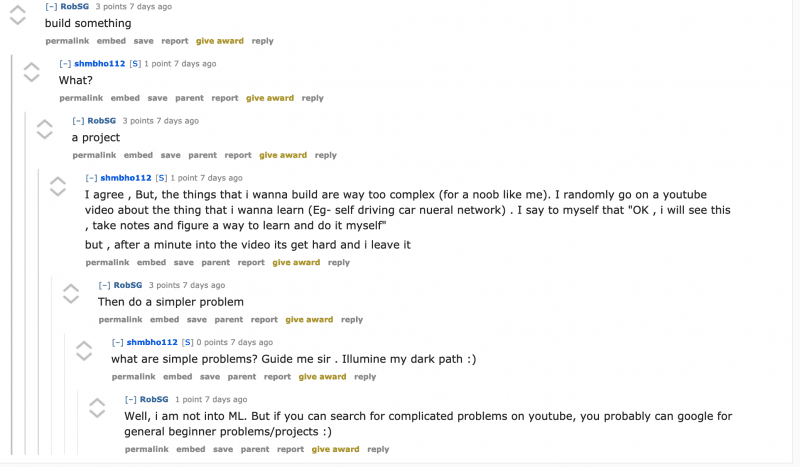
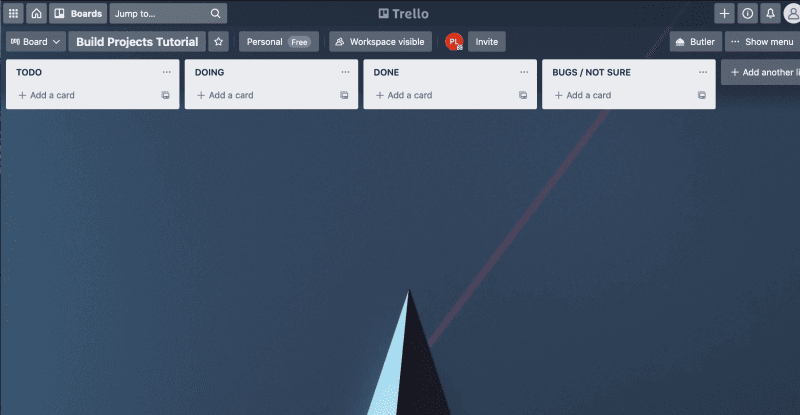
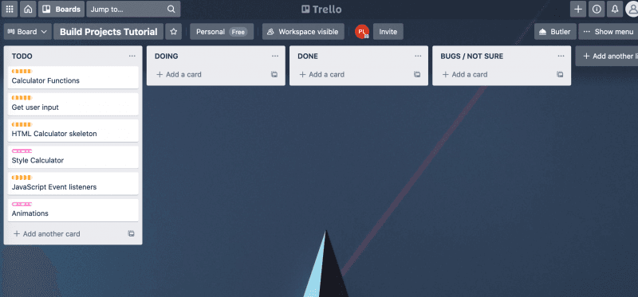
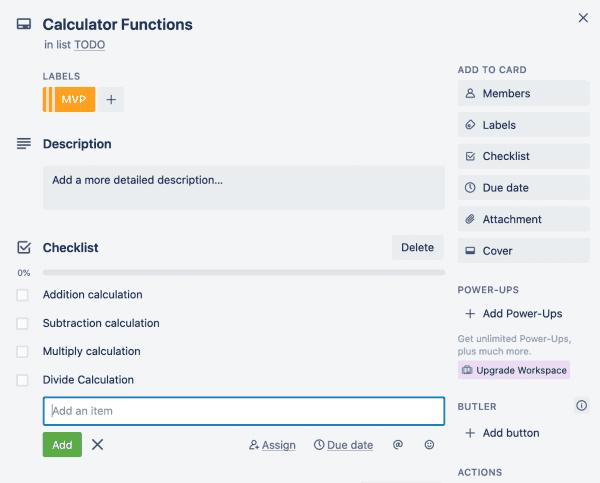

# planning

**Source**: [How to Plan and Build a Programming Project](https://www.peterlunch.com/blog/how-to-plan-and-build-a-programming-project)

In this article, I am going explain how to plan and build a programming project. I will show you how to break down a programming project, so that you can start making awesome projects to help you level up your coding skills.

What this article isn't is a post on how to structure your folders, the best practices when building a project or how to set up your VS code extensions to ensure clean code when building. It is an article to help code newbies feel less intimidated as they attempt to leave tutorial purgatory and build their own coding projects.

Projects are intimidating when you are first starting out, it can seem like such a huge mountain to climb when you can't reproduce the results of the YouTube tutorial you just watched without looking at it again 30 times.

When I first started out learning to code, I would start a course or follow a tutorial and think that I was understanding the material. Yet, when I'd stop watching and try to reproduce the project I couldn't get anywhere.

To overcome this, I posted my frustration on the popular subreddit[r/learnprogramming](https://www.reddit.com/r/learnprogramming/). The responses I received were all centered around building my own projects. This advice sounds great on the surface and was the right advice, yet the issue for me was I couldn't even watch a tutorial and reproduce the results. How was I supposed to build a project? A project is 10 levels above a tutorial and at the time it seemed that projects were so far away from my abilities. I had no clue how to even get started, let alone how I was going to put it all together. The problem essentially was I didn't know how to get from point A to point B.

This is an issue I see all the time on r/learnprogramming. Beginners like me are frustrated that they can't seem to get out of tutorial purgatory and so they seek advice. But, what they get is well meaning redditor's slamming the build projects response in their face without even considering that if the newbie can't even replicate a tutorial how are they going to create their own project.  In my time learning to program I have seen so many examples of the same question I had and the same responses. I thought it was about time I did something about it and gave back to the universe.

So here I am, writing a post that actually breaks down how to build your own projects so that you can become a better developer and cement what you learning.

In order to plan and build a programming project there are three key steps I now use when building projects so let's start with the first step.

## Step 1: Defining the project

The first step when planning a programming project is to define it.

The project definition is a description of the project in human language. It should be super simple so that anyone reading it can understand what the project is about.

When I am defining the project I ask myself these 4 questions:

1.  What is the project?
2.  What is the [MVP](https://www.productplan.com/glossary/minimum-viable-product/) (Minimal Viable Product)?
3.  What are the sprinkles?
4.  When will the project be complete?

### Doughnut (MVP) before the sprinkles

One of the most important lessons I was taught early on in my coding bootcamp was that you need the doughnut before the sprinkles.

It is always very tempting to want to make something look fantastic and to add awesome features that will really impress a potential employer. But, if your application doesn't perform the basic functionality it is supposed to then those awesome features aren't going to shine. The sprinkles have no doughnut to go on.

So make sure you identify what the minimal viable product is before you get started with your sprinkles.

### Example project definition

To give a simple example, let's say we are going to build a calculator app we would have a basic project definition like below.

**Calculator app project**

_What is the project?_ - The calculator project is a project to build a calculator that is accessible in a web browser. The project is going to be solved using HTML, CSS and JavaScript. It will allow users to input numbers and calculate the results of those numbers based on the arithmetic operation they choose.

_What is the MVP ?-_ The minimal viable product is a calculator that renders in a web browsers that can perform addition, subtraction, multiplication and division operations based on a users input and show the user the result of that equation.

_What are the sprinkles?_ - The sprinkles for this project are styling the calculator, taking keyboard presses as input not just users clicking buttons and adding higher order operations like to the power of x.

_When will the project be complete? -_ The project will be complete once all the MVP features have been implemented and the calculator has been styled.

The above definition is simple and straight forward. If my Mum picked it up she would understand what the project is about. She would understand because it tells you what the project is, the MVP features you must build, the nice to have features and when it will be complete. By defining the project you make a project less intimidating.

Once you have the project definition you can begin the next step.

## Step 2: Creating the workflow

The next step is the simplest. Usually this step can be combined with step 3.  But, just for now we are going to look at it here as a separate step so that I can show you how to set up a very basic workflow for your own projects. Once you have done it once, it can be a default step for the rest of your projects.

You first want to use something like [Trello](https://trello.com/) a free tool to manage projects. Trello let's us use the [Kanban](https://www.atlassian.com/agile/kanban) workflow framework. You don't need to know or understand what Kanban is as a beginner, you can just use if loosely like a do here.

To set up our Kanban board we want to create 4 columns.

1.  TODO
2.  DOING
3.  DONE
4.  BUGS / NOT SURE HOW TO DO

Within these columns we are going to add cards. As we work on the cards we move them into the **doing** column and once we have finished with that card we can move it to the **done** column. If you have a bug you are stuck on or are not sure how to do something we can move it to the **bugs/not sure column**.

This workflow is a super simplified version of Kanban and when working in a dev role you will most likely have more columns like testing, coding review, backlog and others. But, for your own projects and especially as a beginner this will do the job nicely and let you achieve what you want which is to build projects.

Now we have our workflow set up we can get onto the last step, the one that stumped me the most when I was learning to code.

## Step 3: Breaking the project down into smaller components

The key to building your own projects starts with breaking the big project down into smaller, less intimidating components. These smaller components are what become our cards from step 2.

Now this sounds simple enough, but when I was first starting out it did not occur to me that you could do this. I thought most developers just start coding and the project flowed out of them like you see in the movies. I thought that was what I was supposed to be able to do. However, now that I have had a chance to work in the industry I know that is definitely not the case, in fact a good developer will break that project down into smaller tasks.

Yet, as a beginner it can be hard to know how to break something down into smaller tasks. If you don't know how to actually build the project then how can you break it down?

Well the first thing you need to do is look at your project definition and then break it down into smaller parts.

Let's continue using the calculator app example to make our component cards:

1.  Calculation functions - MVP
2.  Get user input - MVP
3.  HTML user interface - MVP
4.  Style user interface CSS - sprinkles ✨
5.  JavaScript event listeners - MVP
6.  Add animations for calculations - sprinkles ✨

You'll notice that for each card, we assigned a label of either MVP or sprinkles this is to visually help you see which cards are the most important and therefore the ones to work on first.

The biggest benefit of the cards is that they have simplified what we have to do already. This makes projects less intimidating as you are not making a big daunting calculator app, rather you are doing 6 smaller projects that will combine to create one big project.

As you work on a card you move it into the doing column. Taking your time to get the component working before you move onto the next card.

But we are not done yet, we can simplify and improve our workflow even more to ensure we are not getting blocked by the size of the project when building.

### Break each component into smaller checklists

Once we have the high level cards we can then break those components down again into smaller tasks by breaking those tasks into checklists so we can track our progress.

The example below is just how my brain works so you can break it into smaller or larger items depending on what works for you. Let's use the calculation functions card as an example of how to break a component down further.

As the task is an MVP task and I have defined the MVP as basic calculations addition, subtraction, multiplication and division we need to add those functions to the checklist.

We have now broken our calculation functions card into 4 little projects that we can work on. How much easier is that than the abstract and super daunting task of building a calculator app, or even writing the calculator functions (the card).

We can now focus and figure out how to make each of these functions. As we do that we get to check those items off giving us a sense of accomplishment and progress. Then once we have done all four of those items we can move that card into the done column and get cracking on the next card.

From here on we just need to repeat the process for each card. But, you shouldn't spend heaps of time trying to make each card have every single task which brings me onto a mistake I made at the start.

### Don't get stuck making it perfect

When you are breaking out your cards and checklist tasks don't get stuck trying to make sure you have every little function and detail broken down.

If you do that you will likely get stuck in the planning phases and you'll never move onto the building phase or your building phase will be too rigid. You need some wiggle room in your projects.

What I found as I was working on my projects was that I frequently had to add more cards and tasks as I went along. This is inevitable, you are building something for the first time so you are not going to know exactly what you need to build before you start.

You might for instance not have a styling card when you first start planning out your calculator app and only to realize once you finish the HTML skeleton card that you should probably style the app.

So don't get stuck on making the plan perfect, get enough down so you can start and add more as you go. You can also use the **bugs/don't know column** to put cards that you can't yet do or that you are stuck on to help you keep moving.

## Start building your programming project

Now you have the legitimate tools to plan and build a programming project as a beginner. Hopefully this post has made the concept of building projects less abstract and intimidating.

The key is to clearly define the project, set up your workflow and then break the project down into smaller components that all build towards creating the larger project. By doing so the project doesn't seem like this enormous mountain to climb, instead it should feel more like a ladder with each step helping you reach your goal.

If you see someone on r/learnprogramming in the future struggling to get out of tutorial purgatory, don't just tell them to build. Tell them how to plan and build.

Planning is great, but the key is to then start and build. So go forth and build amazing projects and level up your coding skills and share your progress with me on [twitter](https://twitter.com/thelynchpinau).