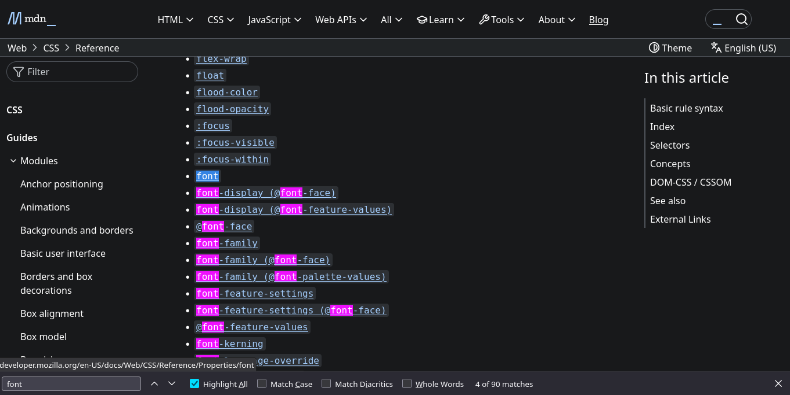
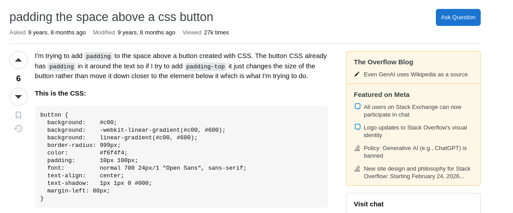

# read documentation

**Source**: [Reading Documentation: A Practical Approach for Beginners](https://gcdi.commons.gc.cuny.edu/2022/10/18/reading-documentation-a-practical-approach-for-beginners/)

When working with programming languages and software libraries, you have likely been referred to “the documentation” for help with understanding how to use a tool. However, as you may have experienced, these resources can be overwhelming, large, complex, and confusing.

Learning to read documentation is an important skill, but one that takes time and experience.

In this post I’d like to share some strategies to help you:

1.  Better navigate through technical jargon.
2.  Better understand the structure and style of documentation.
3.  Feel more confident in your ability to read documentation.
4.  Understand the limits of documentation and when to go beyond it for help.

## What is Documentation?

At its core, documentation is a collection of explanations for employing a particular product or service. It is a “user manual” for software. Unfortunately, it can run the gamut from very thorough to very vague. Oftentimes the more niche a product is, and the smaller the community, the less in-depth the documentation will be.

Confusion may arise partly due to the nature of the documentation’s audience. If these resources are overly thorough in their explanations, experienced developers might find them bloated. On the other hand, if they are too sparse, new developers might find them difficult to understand. Efficient documentation means hitting the sweet spot between thoroughness, understandability, and ease of use.

## “Getting Started” vs “Reference” Docs

Good documentation often has two separate sections, written from different perspectives. Let’s take a look at the documentation for [Leaflet](https://leafletjs.com/), a JavaScript library that allows users to embed interactive maps into a website.

The website’s [Quick Start page](https://leafletjs.com/examples/quick-start/) describes how to begin using the tool, with basic comprehension and implementation instructions. This section offers a quick intro for how to install, configure, and use the product. On the other hand, Leaflet’s [full reference doc](https://leafletjs.com/reference.html) is more like a dictionary or glossary of presets, methods, and actions. Here, information density is prioritized, unlike the Quick Start, which presents a readable tutorial you can follow along with.

Most documentation follows this basic structure. There will likely be a section for installing and getting the tool running, and another for a comprehensive list of commands the tool provides.

## The Art of ~Reading~ Referencing

For the most part, documentation isn’t meant to be “read” in the traditional sense. Rather, it is meant to be _referenced_. With a sense of the overall structure, you can usually jump through non-chronologically, where using **ctrl + f** (find) is often the best approach.

Now, let’s look at Mozilla Developer Network’s (MDN) [CSS reference docs](https://developer.mozilla.org/en-US/docs/Web/CSS/Reference). CSS defines the style and visual appearance of websites, and docs on this topic are quite overwhelming. This guide contains CSS’ numerous properties and values, as well as a lot of information about each. However, if we want to know how to change the font properties of a particular piece of text, we can simply **ctrl** + **f** “font” to find all the relevant information:

This is a good example of how documentation works. The baseline property, in this case, **font**, is our first highlighted result to which everything else is related. We can specify directly the font-size, the font-weight, the [font-kerning](https://developer.mozilla.org/en-US/docs/Web/CSS/font-kerning), etc.—these are all _derivatives_ of the baseline property (font). Documentation often follows this approach, detailing the most rudimentary forms of a command, followed by increasingly complex use-cases.

In general, when searching for terms, first look to _the most basic_ instance. It will likely provide you with the foundational concept that you’re looking for, and let you expand upon it.

A few more general tips for dealing with documentation:

1.  **Don’t skip the guides.** If a tutorial or guide is provided, it is usually worthwhile to go through it. A well-done guide can often offer the context needed to get started.
2.  **Don’t get discouraged if you don’t understand.** There may be many aspects of the documentation that make little to no sense, which can quite easily lead to frustration. Instead, try to focus on the terminology that _does_ make sense to you, and see if you can figure out how and why it is being used.
3.  **Try to use open-source software whenever possible.** Because anyone can inspect, modify, and rework the source code of an open-source project, there may be more helpful documentation of these tools. Since the success of open-source projects can often _depend_ on their quality of documentation, this can give open-source developers extra incentive to provide useful docs that closed-source projects may not have.

## Beyond the Docs

### _Use a Search Engine_

There are a number of reasons referencing official documentation is the best approach for learning a language or tool. However, while documentation is best utilized when you have a very specific end goal, and when you already have a basic sense of how it might be accomplished, this might not always be the case, especially when you are first starting out.

If you aren’t quite sure what you are looking for—and **ctrl + f** isn’t helpful—using a search engine is a good next step. However, there are some best practices for this as well.

For example, to stick with CSS, let’s say you created a button on a web page, and want to add some space around it. How would you do it? What keywords would you use?

Programming isn’t that different from other software contexts you have encountered. Thinking about the typical word processing document, in adding space around something you are probably dealing with margins. Aside from **ctrl** + **f** “margin” in the docs, you could also turn to a search engine. In this case, your search parameters might be: “adding margins around a button css” or even “adding space around a button css.” Note that we are explicitly searching here for CSS. Specifying the language is important to help narrow down the search results.

### _Stack Overflow_

Stack Overflow is a popular resource for developers, and is a great place to find answers to all kinds of questions, and even to share your knowledge with others if you’re up to it. It is a question/answer forum, which currently contains over 21 million programming questions. If you have a question or issue about your code, it is very likely someone else has had it too. If not, you can pose the question to the Stack Overflow community.

Let’s say we typed the following in a search engine: “create space around a button css”. As is typical with many search results, the first hit of this query is not actually pointing us to any documentation, but rather to [this Stack Overflow question](https://stackoverflow.com/questions/37879447/padding-the-space-above-a-css-button).

Take a quick look at the question to make sure it’s relevant to your problem. Then, scroll through the answers and discussions to find what you’re looking for. You may also find some snarky and rather unhelpful responses, as is the case on any forum. For our example, there are many answers, and almost every one offers a different way to solve the problem. It is worth noting that this question was asked over 6 years ago, something you might want to consider as some answers may now be out of date. In any case, there is a plethora of information that should help point you in the right direction.

Implementing code snippets from Stack Overflow is an incredibly common practice, and is even the source of many jokes.

Don’t feel the need to reinvent the wheel if you find a working solution on Stack Overflow. However, do pay close attention to any code you wrangle with, and make sure you understand what it is doing and how it fits into your overall program/project.

## Final Thoughts

In general, keep in mind that documentation is best used as a reference. It may not always be the best place to start for beginners. Beyond that, search engines and Stack Overflow serve as excellent jumping-off points. It is essential to learn is how to find answers to your questions, and this means learning how to ask the *right* questions, as fellow Digital Fellow Leanne Fann explores [in this post](https://digitalfellows.commons.gc.cuny.edu/2021/12/15/how-to-ask-coding-questions/). As a recap, when searching, be sure to:

1.  Include the language/tool you are searching in as a search parameter.
2.  Break down your search into keywords.
3.  Be specific.
4.  Don’t be afraid to copy/paste and tweak results to fit your programs, but be sure to understand what the code is doing as best you can.

Once you have found what looks like a solution to your question, _then_ read the documentation so you have a more robust understanding of your code and the tool as a whole.

As always, for more useful advice, be sure to check out the workshops, guides, and other resources we offer at the GCDI! You can peruse our offerings at [the main website here](https://gcdi.commons.gc.cuny.edu/).

