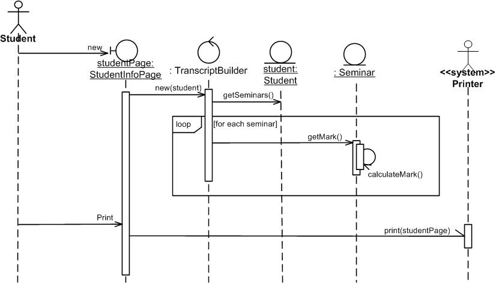
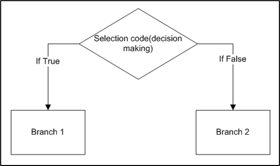

# programming fundamentals

_I hope mods are okay with this. I also published this text on some other page so it is not stolen._

## Intro

It is 2021 and there are so many people working as programmers. If you want to be part of that world, you need to know the programming basics.

Why is this post better than most of the other posts or video courses on the internet? And also how can this be a post about programming when there is not any programming language in it?

Well, there is a difference between learning to program and learning some programming language. You could 'learn' two programming languages and there is a chance that you would still not know how to program.

Learning a programming language is the same as learning a foreign language. Learning to program is like learning to think. When people are born they have the ability to think. That ability naturally gets better and better with time. That means most people would react in the same way in the same situation no matter where are they from. For example, if they see an accident on the road, they would call an ambulance. The only difference is that they would use their own language to describe the accident.

**The ability to think is not bounded or dictated by some language**. If you learn a new language, your ability to think would not change at all. The same thing is with programming. Programming concepts are independent of programming languages.

In this post, I will teach you programming concepts that will help you learn any programming language. Learning this way is much faster and you are not distracted by the syntax of the programming language.

## How to think like a programmer?

This is a question that is asked by many people who wants to start with programming. And to answer it straight away - you need to use an **algorithmic approach** to solving problems. What does that mean exactly? I will explain it in this chapter.

[Computer programming](https://en.wikipedia.org/wiki/Computer_programming) is the process of designing and building an executable computer program. A computer program is a **collection of instructions** that can be executed by a computer to perform a specific task.

In layman's terms, programming is just telling a computer what it needs to do. To describe to a computer what it needs to do, programmers use various programming languages.

Now, I would require you to take a pen and paper or just open your favorite text editor and write down all steps you need to do to make a bowl of cereals. I will do the same thing, but I will do it in a way that is similar to describing it to a computer. After you are done you can compare yours and my result:

My result:

- go to the fridge and open its door
- take out a bottle of milk and put it on the table
- close the fridge door
- go to a cupboard (or cabinet) and open its door
- take out a cereal box and bowl and put those to the table, next to milk (this step depends on where you are keeping bowls and cereals)
- close the cupboard door
- go to the drawer with spoons and open it
- take one spoon and close the drawer
- go to the table, put the spoon next to a bowl
- grab cereal box and take the plastic bag out of it (let's assume that cereals are inside a plastic bag)
- pour cereal out of the plastic bag into a bowl until the bowl is half-full or one-third full
- return the plastic bag to the cereal box (or throw it away if it is empty)
- grab a bottle of milk and open it
- pour milk over the cereal that is inside the bowl until the bowl is half full
- close the bottle of milk and put it on the table

And this is it, breakfast is ready.

This is how programmers think. You can see that it is not anything complicated and that everybody can do that. In the steps above there are some extra cases that I left out for simplicity of demonstration like what if milk is not in the fridge, what if you run out of milk or cereal, what if you don't have any clean spoon or bowls, what if you dropped and broke a bowl, etc.

But you got the idea. And in the following video, you will see what happens if you are not specific and detailed when you are writing instructions (or code). Check out this video:

[https://www.youtube.com/watch?v=cDA3_5982h8](https://www.youtube.com/watch?v=cDA3_5982h8)

This is how programming works most of the time. You know what you have to do, you write code for that, and then you test does it work what it needs to do. If not, then you know that you did something wrong. You change your code and try again until you get the right solution.

## Algorithm

In this chapter, I will explain things in a formal way.

An [algorithm](https://www.verywellmind.com/what-is-an-algorithm-2794807) is a defined set of step-by-step procedures that provides the correct answer to a particular problem.

The algorithm needs to satisfy the following conditions to be valid:

- same inputs always need to produce the same output
- must be unambiguous meaning that is explicitly defined and only one interpretation is possible
- must be finite meaning that it needs to be done in finite time and use finite space

The best example of an algorithm that you saw in your life is a meal recipe. You know how long it will take to cook that meal, what groceries you need, and in what order you need to prepar them. And if you follow that recipe twice and make the meal in the exact same way both times you will get the same meal.

To solve tasks with programming, the first thing we need to do is to devise an algorithm. When you are doing that, it is a good idea to write it down. There are two ways to write an algorithm - with flowchart and with pseudocode.

### Flowchart

A [flowchart](https://en.wikipedia.org/wiki/Flowchart) is a type of diagram that represents a workflow or process. A flowchart can also be defined as a diagrammatic representation of an algorithm, a step-by-step approach to solving a task.

Each flowchart consists of its building blocks. To understand a flowchart, you first need to know what each building block means. I created this simple table so you can always return here until you learn them all.

As you can see, there are not a lot of them. Some other exists but they are not important right now. I will show you how to solve tasks using only these symbols. Let's start with examples.

### Sequence

Instructions in programs are executed in the sequence in which they are written. Let's create a flowchart for a simple task in which the user will input two numbers and the program will print out a sum of those two numbers.

### Branching

If some part of code in the algorithm we need to execute only in case if some condition is fulfilled then we need to use branching. With branching, we can split the code into two or more paths. To show an example of branching let's create a flowchart for a program that takes the user's input which is a number and prints "Number is positive" or "Number is negative".

### Loops

Sometimes in code, we need to do the same thing several times. We always have two choices. One is to write the same code several times and the other is to use a loop. The problem with writing the same code several times is that is it not clean and it is time-consuming. That is why we should use loops.

In computer programming, a loop is a sequence of instructions that is continually repeated until a certain condition is reached. Most of the time we write a loop with some kind of a counter so the loop knows how many times it needs to execute the same code and when to stop. Let's create a flowchart for a program that takes a number as the user's input and prints all (whole) numbers between 0 and that number.

As you can see, the loop repeats three steps: checking if variable A is lower than variable Counter, print value of variable Counter, and increase the value of variable Counter by one.

**Now try to solve this task by yourself:** Make a program that takes the user's input and check if it is number 0. If it is not, then print the square of that number and if it is 0 then finish the program.

You can check the solution on Reddit.

### Variables

In previous tasks I always mentioned variables but I never explained what it is. Variables are locations in memory that have some name and in which we save data from the input. The value of each variable can be changed during program execution. To access the value of a variable we only need to write its name.

Each variable has a name, a value, and a type. I will talk about data types a bit later. To assign value to a variable we need to write the name of the variable then equality sign '=' and then the value.

For example:

To assign a value 10 to a variable with the name 'age' we just need to write `age = 10`.

If we want to change the value of the variable 'age' we can do it in the same way `age = 30`. That is called re-assigning.

It is always a good idea to name variables in a descriptive way instead of using just one letter like 'A' or 'x'.

### Data types

In computer science and computer programming, a [data type](https://en.wikipedia.org/wiki/Data_type) or simply type is an attribute of data that tells the computer how the programmer intends to use the data. I will not bother you with the details, you just need to remember these five common data types:

- Integer (int) - this data type is used for whole numbers. For example int age = 20 or int size = 10
- String - this data type is used for text or sequence of characters. For example string name = "John Doe" or string sentence = "Today is a sunny day." Usually, a string is always surrounded with quotation marks
- Character (char) - this data type is used for a single letter. char letter = 'a'
- Float - this data type is used for numbers that contain a decimal point. For example float number = 3.14
- Boolean (bool) - this data type is used for True or False only ( yes or no, 0 or 1). For example bool flag = True

As I mentioned before - Each variable has a name, a value, and a type. When I write

`int age = 10`

int is the type of the variable, age is the name of the variable, and 10 is the value of that variable.

### Arithmetic operators

In programming, you can use arithmetic operators between variables or some concrete value. Addition, subtraction, multiplication are the same as in math and division is a bit different.

For example, you can write this:

`sum = a + b -> this will save the sum of values a and b into variable sum`

`c = d - 7 -> this will save the result of subtraction to variable c`

`result = 15 * 3 -> this will save 45 in variable result`

There are three 'types' of division:

`x = a/b -> this is real division`

`y = 13 DIV 5 -> this is integer division and it will save 2 in variable y`

`z = 13 MOD 5 -> this is remainder and it will save 3 in variable z`

### Relational operators

In computer science, a [relational operator](https://en.wikipedia.org/wiki/Relational_operator) is a programming language construct or operator that tests or defines some kind of relation between two entities. These include numerical equality (e.g., 5 = 5) and inequalities (e.g., 4 ≥ 3).

The result of the evaluation is either true or false. Relational operators are used for branching which I explained above.

Operators are: equal to (==), not equal to (≠), greater than (>), less than (<), greater than or equal to (≥), less than or equal to (≤).

### Boolean operations

Boolean operations come from [Boolean algebra](https://en.wikipedia.org/wiki/Boolean_algebra) in which which the values of the variables are either true or false (1 or 0). I don't want to bother you much with Boolean algebra but there are three main operations you need to know about:

- AND - conjunction - the result of this operation is true only when both conditions are true, otherwise false
- OR - disjunction - the result of this operation is true when either of the conditions is true
- NOT - negation - this operation inverts the value of the condition. If the condition is true then negation will result in false and vice versa.

Boolean operations are also mostly used for branching and can be combined with relational operators. For example, if you have a task in which you need to check if the number is lower than 50 and it is not 7 then you would do that in a flowchart like this:

And this is it. If you have understood everything so far **you can say that now YOU can think like a programmer**. This is the bare minimum you need to know to start with programming. This is the foundation on which you build more and more knowledge.

You might notice that we did not start with any programming language. It is because everything above can apply to most programming languages. Now when you understand the foundation you can easily start with any programming language.

If you do not understand some part or you need extra explanation you can always search on Google or you can ask me on Reddit

I will give you some tasks to practice, something like homework. I will publish solutions and explanations to those tasks on Reddit in near future.

### Homework tasks

To solve these tasks you will use the knowledge from above. For each task, you need to draw a flowchart. You can draw flowcharts online on [diagrams.net](https://app.diagrams.net/)

1.  Create a program that allows to user to input three numbers and print the product of that three numbers.
2.  Create a program that allows to user to input a number. Print if that number is odd or even. Hint - you need to use the remainder operator.
3.  Create a program that allows to user to input a number. Multiply that number by 2 and print it out. Repeat multiplication and printing until the result of the multiplication is not larger than 1000.
4.  Create a program that prints all numbers between 1 and 100 that are not divisible by 7 and are divisible by 5.
5.  Create a program that allows to user to input a number. If the number is 0, end the program and print "The end". Otherwise, multiply that number by itself and check if that new number is larger than 1000. If yes then print "Extra large number". If the number is larger than 500 then print "Large number", otherwise print "Small number"

## Next steps

Once you are done with the practice tasks above you might ask what are the next thing to do or learn. It is obvious you can't do much with just a knowledge of drawing flowcharts.

Now you can select one programming language and learn its syntax. I would recommend learning Python or JavaScript. Both languages are easy to set up on your computer and syntax is straightforward. For know, if you are at this stage of programming experience, I would recommend you to pick either Python or JavaScript and not C#, Java, or any object-oriented programming language.

If you want to learn JavaScript and explore web development with it, you can start with [The Odin Project](https://www.theodinproject.com/paths/foundations/courses/foundations). It is a website that will walk you through the installation of proper tools, explain how the web works, how to use git and there are basics in HTML, CSS, and JavaScript. If you like to watch videos you can find many good JavaScript tutorials on YouTube.

If you want to learn Python which is a good programming language for multiple stuff you can follow this book - [Automate the boring stuff with Python.](https://automatetheboringstuff.com/#toc) It starts with Python basics and progresses into some real-world problems that are easily solved with Python. If you don't like it, you can always look for videos on YouTube.

## Conclusion

In this post, I explained to you the fundamentals that you need to know to start with programming. These fundamentals are applicable to most programming languages and now you need to pick one and learn its syntax.

Programming is not hard as it might seem. You need to be patient with yourself, invest some time and effort in understanding the basics.

I just want to point out the importance of starting with easier tasks and then progressing towards some bigger project you might want to build. You can not learn some foreign language over the night but you will get better and better with it over time - it is the same with programming.

When you learn the syntax of some programming language try to solve tasks from the homework chapter with that programming language.

## Source

[How to start programming from zero](https://old.reddit.com/r/learnprogramming/comments/pxg54p/how_to_start_programming_from_zero/)